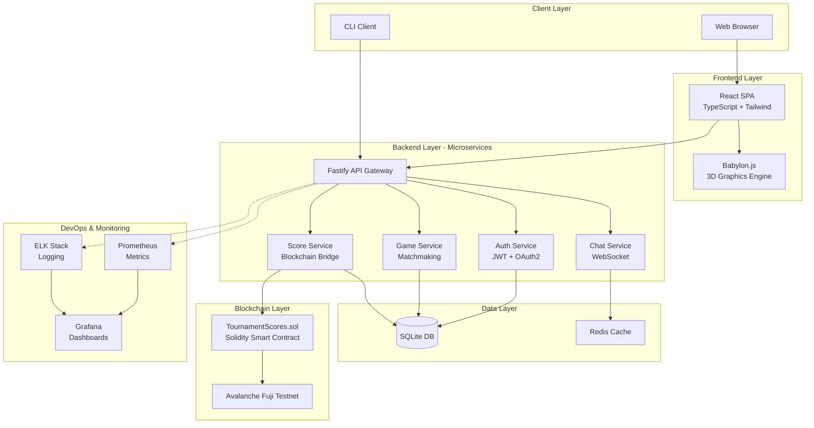
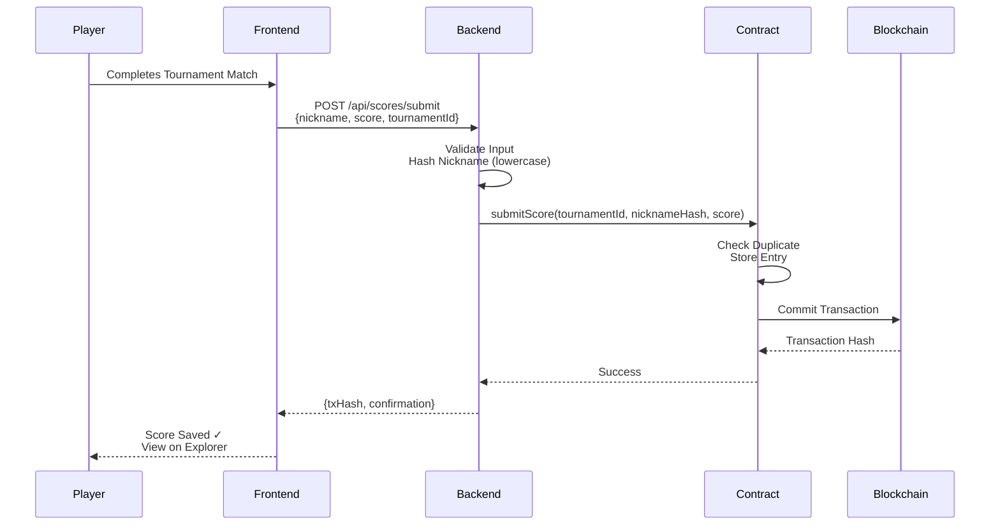
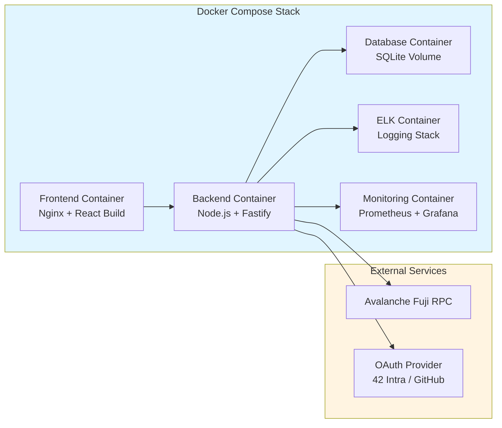
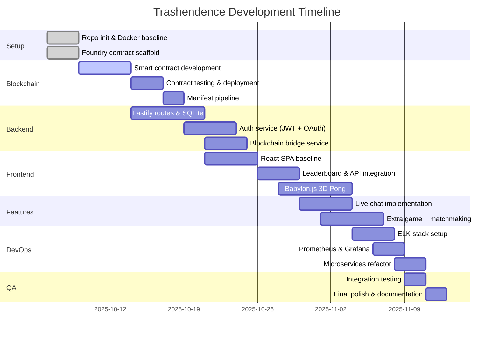

# Trashendence

A modern Pong web application integrating blockchain-backed scores, modular architecture, and scalable infrastructure.  
Built for the **ft_transcendence (v18)** project.

---

## Overview

Trashendence reimagines Pong as a modular, extensible web platform.  
Players compete in tournaments, and their scores are permanently stored on a blockchain for transparency.  
The project combines real-time gameplay, user management, and backend scalability through microservices and monitoring.

---

## Features

* ✨ Real-time Pong gameplay (local and remote planned)
* 🏆 Tournament system with nicknames
* ⛓️ Blockchain-based score storage (Avalanche Fuji testnet)
* 🔐 Secure authentication (standard + remote OAuth2)
* ⚡ Modular backend using Fastify and SQLite
* 🎮 3D visual upgrade (Babylon.js)
* 💬 Live chat and matchmaking
* 🐳 CI/CD with containerized deployment
* 📊 Logging and monitoring infrastructure (ELK + Prometheus/Grafana)

---

## Architecture

### High-Level System Overview



### Data Flow: Score Submission



### Deployment Architecture



---

## Tech Stack

| Layer      | Technology                       | Purpose                            |
|------------|----------------------------------|------------------------------------|
| Frontend   | React, TypeScript, Tailwind      | SPA UI and leaderboards            |
| Backend    | Fastify (Node.js)                | API, validation, blockchain writes |
| Blockchain | Solidity + Foundry               | Tournament and score storage       |
| Database   | SQLite                           | Persistent app data                |
| DevOps     | Docker, ELK, Prometheus, Grafana | Deployment, logs, monitoring       |
| 3D Engine  | Babylon.js                       | Enhanced Pong visuals              |
| Auth       | OAuth2, JWT, 2FA                 | Secure user authentication         |

---

## Development Setup

```bash
# Clone repo
git clone https://github.com/ppezzull/42-Common-Core.git
cd 42-Common-Core/Trash

# Install dependencies
npm install

# Setup environment
cp .env.example .env
# Edit .env with your private key and RPC URL

# Compile smart contracts
cd foundry
forge build

# Run contract tests
forge test

# Deploy contract to Fuji testnet
forge create src/TournamentScores.sol:TournamentScores \
  --rpc-url $FUJI_RPC \
  --private-key $DEPLOYER_PK \
  --verify

# Save deployed contract data
npm run export:manifest

# Return to root and start all services
cd ..
docker compose up --build
```

**Local Development URLs:**
- Frontend: http://localhost:3000
- Backend API: http://localhost:4000
- Grafana: http://localhost:3001
- Kibana: http://localhost:5601

---

## Deployment (Docker/CI)

### Pipeline Steps

1. **Deploy Contract** → Capture address + ABI
2. **Generate Manifest** → `contracts.manifest.json`
3. **Build Images** → Frontend + Backend Docker images
4. **Compose Stack** → Single `docker compose up` command

### Artifacts Structure

```json
// contracts.manifest.json
{
  "address": "0x...",
  "chainId": 43113,
  "abiPath": "TournamentScores.abi.json",
  "deployedAt": "2025-10-15T12:00:00Z",
  "network": "avalanche-fuji"
}
```

---

## Modules and Roles

| Module                                              | Type  | Assigned                                                |
|-----------------------------------------------------|-------|---------------------------------------------------------|
| Use a framework to build the backend (Fastify)      | Major | Andrea Falconi, Pietro Jairo Pezzullo                   |
| Use a framework/toolkit for the frontend (Tailwind) | Minor | Gabriele Rinella                                        |
| Use a database for the backend (SQLite)             | Minor | Andrea Falconi                                          |
| Store tournament scores in the Blockchain           | Major | Pietro Jairo Pezzullo                                   |
| Standard user management + authentication           | Major | Andrea Falconi                                          |
| Implement remote authentication (OAuth2)            | Major | Andrea Falconi                                          |
| Add another game with user history + matchmaking    | Major | Gabriele Rinella, Eugenio Caruso                        |
| Game customization options                          | Minor | Gabriele Rinella, Eugenio Caruso                        |
| Live chat                                           | Major | Andrea Falconi, Pietro Jairo Pezzullo, Gabriele Rinella |
| Advanced 3D techniques (Babylon.js)                 | Major | Gabriele Rinella, Eugenio Caruso                        |
| Infrastructure setup for log management (ELK)       | Major | Ruggero                                                 |
| Monitoring system (Prometheus + Grafana)            | Minor | Ruggero                                                 |
| Backend as microservices                            | Major | Ruggero, Andrea Falconi                                 |

**Total:** 9 Major + 4 Minor = **11 Modules** (exceeds 7 major minimum ✓)

---

## Expected File Tree

```
trashendence/
├── README.md
├── en.subject.pdf
├── Makefile
├── docker-compose.yml
├── .env.example
├── .gitignore
│
├── foundry/                        # Smart contracts
│   ├── src/
│   │   ├── TournamentScores.sol
│   │   └── Counter.sol             # Example
│   ├── test/
│   │   ├── TournamentScores.t.sol
│   │   └── Counter.t.sol
│   ├── script/
│   │   └── Deploy.s.sol
│   ├── foundry.toml
│   └── README.md
│
├── backend/                        # Fastify backend
│   ├── src/
│   │   ├── server.ts
│   │   ├── routes/
│   │   │   ├── auth.routes.ts
│   │   │   ├── scores.routes.ts
│   │   │   ├── chat.routes.ts
│   │   │   └── game.routes.ts
│   │   ├── services/
│   │   │   ├── blockchain.service.ts
│   │   │   ├── auth.service.ts
│   │   │   └── db.service.ts
│   │   └── middleware/
│   │       ├── jwt.middleware.ts
│   │       └── validation.middleware.ts
│   ├── Dockerfile
│   ├── package.json
│   ├── tsconfig.json
│   └── .env.example
│
├── frontend/                       # React frontend
│   ├── src/
│   │   ├── components/
│   │   │   ├── Pong/
│   │   │   ├── Leaderboard/
│   │   │   ├── Chat/
│   │   │   └── Auth/
│   │   ├── pages/
│   │   │   ├── Home.tsx
│   │   │   ├── Tournament.tsx
│   │   │   └── Profile.tsx
│   │   ├── hooks/
│   │   │   └── useBlockchain.ts
│   │   ├── viem/
│   │   │   └── config.ts
│   │   ├── App.tsx
│   │   └── main.tsx
│   ├── public/
│   ├── Dockerfile
│   ├── package.json
│   ├── vite.config.ts
│   ├── tailwind.config.js
│   └── tsconfig.json
│
├── devops/                         # Infrastructure
│   ├── docker-compose.yml
│   ├── monitoring/
│   │   ├── prometheus/
│   │   │   ├── prometheus.yml
│   │   │   └── alerts/
│   │   └── grafana/
│   │       ├── dashboards/
│   │       └── datasources/
│   └── logging/
│       ├── elasticsearch/
│       │   └── elasticsearch.yml
│       ├── logstash/
│       │   └── logstash.conf
│       └── kibana/
│           └── kibana.yml
│
├── shared/                         # Shared artifacts
│   ├── contracts.manifest.json
│   └── types/
│       └── contracts.types.ts
│
└── docs/                           # Documentation
    ├── subject.md
    ├── foundry.md
    ├── API.md
    └── DEPLOYMENT.md
```

---

## Roadmap (06/10/2025 → 12/11/2025)



| Week                   | Focus                | Deliverables                                 |
|------------------------|----------------------|----------------------------------------------|
| Week 1 (06–13 Oct)     | Setup & Planning     | Repo init, Docker baseline, Foundry contract |
| Week 2 (14–20 Oct)     | Blockchain Module    | Contract deploy + manifest pipeline          |
| Week 3 (21–27 Oct)     | Backend Core         | Fastify routes, SQLite setup                 |
| Week 4 (28 Oct–03 Nov) | Frontend Integration | React leaderboard, API bridge                |
| Week 5 (04–10 Nov)     | 3D Game & Live Chat  | Babylon.js visuals, chat MVP                 |
| Week 6 (11–12 Nov)     | DevOps & QA          | Logging, monitoring, final polish            |

---

## Smart Contract Details

### TournamentScores.sol Structure

```solidity
struct Entry {
    bytes32 nicknameHash;  // keccak256(lowercase(nickname))
    uint32 score;          // Player score
}

struct Tournament {
    bool exists;
    uint64 createdAt;
    Entry[] entries;                   // Append-only score list
    mapping(bytes32 => bool) seen;     // Prevent duplicate nicknames
}

mapping(bytes32 => Tournament) public tournaments;
```

**Key Functions:**
- `createTournament(bytes32 tournamentId)` - Initialize new tournament
- `submitScore(bytes32 tournamentId, bytes32 nicknameHash, uint32 score)` - Submit score
- `getLeaderboard(bytes32 tournamentId)` - Retrieve all scores
- `getTournamentInfo(bytes32 tournamentId)` - Get tournament metadata

**Tournament ID Generation:**
```
tournamentId = keccak256(abi.encodePacked(season, bracket, date))
```

---

## API Endpoints

### Authentication
```
POST   /api/auth/register        - Register new user
POST   /api/auth/login           - Login with credentials
POST   /api/auth/oauth/callback  - OAuth2 callback
GET    /api/auth/me              - Get current user
POST   /api/auth/2fa/enable      - Enable 2FA
POST   /api/auth/2fa/verify      - Verify 2FA token
```

### Scores & Blockchain
```
POST   /api/scores/submit        - Submit score to blockchain
GET    /api/scores/:tournamentId - Get tournament leaderboard
GET    /api/scores/verify/:txHash - Verify transaction on chain
```

### Game & Matchmaking
```
POST   /api/tournaments/create   - Create new tournament
GET    /api/tournaments/:id      - Get tournament details
POST   /api/matchmaking/join     - Join matchmaking queue
GET    /api/matchmaking/status   - Get queue status
```

### Chat
```
WebSocket /ws/chat               - Real-time chat connection
POST   /api/chat/direct          - Send direct message
GET    /api/chat/history/:userId - Get chat history
POST   /api/chat/block/:userId   - Block user
```

---

## Environment Variables

### Backend (.env)
```bash
# Server
NODE_ENV=production
PORT=4000
HOST=0.0.0.0

# Database
DATABASE_URL=./data/app.db

# Blockchain
FUJI_RPC_URL=https://api.avax-test.network/ext/bc/C/rpc
CHAIN_ID=43113
DEPLOYER_PRIVATE_KEY=0x...
CONTRACT_ADDRESS=0x...

# Auth
JWT_SECRET=your-super-secret-jwt-key
JWT_EXPIRY=7d
OAUTH_CLIENT_ID=your-oauth-client-id
OAUTH_CLIENT_SECRET=your-oauth-secret
OAUTH_CALLBACK_URL=http://localhost:4000/api/auth/oauth/callback

# 2FA
TOTP_SECRET_KEY=your-totp-secret

# External Services
REDIS_URL=redis://redis:6379
```

### Frontend (.env)
```bash
VITE_API_URL=http://localhost:4000
VITE_WS_URL=ws://localhost:4000
VITE_CONTRACT_ADDRESS=0x...
VITE_CHAIN_ID=43113
VITE_RPC_URL=https://api.avax-test.network/ext/bc/C/rpc
```

---

## Testing

### Smart Contract Tests
```bash
cd foundry

# Run all tests
forge test

# Run with verbosity
forge test -vvv

# Run specific test
forge test --match-test testSubmitScore

# Coverage report
forge coverage
```

### Backend Tests
```bash
cd backend

# Unit tests
npm test

# Integration tests
npm run test:integration

# E2E tests
npm run test:e2e

# Coverage
npm run test:coverage
```

### Frontend Tests
```bash
cd frontend

# Unit tests
npm test

# Component tests
npm run test:components

# E2E with Playwright
npm run test:e2e
```

---

## Security Considerations

### Implemented Protections
- ✅ Password hashing with bcrypt (cost factor 12)
- ✅ JWT tokens with secure signing algorithm (HS256/RS256)
- ✅ Input validation and sanitization (Zod schemas)
- ✅ SQL injection protection (parameterized queries)
- ✅ XSS protection (React DOM sanitization)
- ✅ HTTPS/WSS enforcement in production
- ✅ Rate limiting on API endpoints
- ✅ CORS policy configuration
- ✅ Content Security Policy headers
- ✅ Private keys stored in .env (gitignored)

### Smart Contract Security
- Reentrancy guards on state-changing functions
- Access control for admin functions
- Input validation for all parameters
- Events emitted for transparency
- Audited with Slither static analyzer

---

## Contributing

### Branch Naming Convention

```
feature/backend-fastify           - Backend framework setup
feature/frontend-tailwind         - Frontend styling
feature/blockchain-scores         - Smart contract & integration
feature/user-auth                 - Standard authentication
feature/remote-oauth              - OAuth2 implementation
feature/extra-game                - Additional game module
feature/customization             - Game options
feature/livechat                  - Real-time chat
feature/3d-graphics               - Babylon.js integration
feature/logging-elk               - ELK stack setup
feature/monitoring                - Prometheus & Grafana
feature/microservices             - Backend refactoring
```

### Workflow

1. **Create branch** from `main`
   ```bash
   git checkout -b feature/your-module
   ```

2. **Implement module**
   - Follow project conventions
   - Write tests
   - Update documentation

3. **Open Pull Request**
   - Describe changes clearly
   - Link related issues
   - Request review from teammate

4. **Review & Merge**
   - At least 1 approval required
   - All checks must pass
   - Squash and merge to main

### Code Style

- **TypeScript/JavaScript:** ESLint + Prettier
- **Solidity:** Foundry formatter
- **Commit messages:** Conventional Commits format
  ```
  feat: add blockchain score submission
  fix: resolve JWT token expiration bug
  docs: update API documentation
  test: add tournament creation tests
  ```

---

## Monitoring & Observability

### Metrics (Prometheus)
- API request duration and count
- Database query performance
- Blockchain transaction success rate
- WebSocket connection count
- Error rates by endpoint

### Logs (ELK Stack)
- Structured JSON logging
- Log levels: ERROR, WARN, INFO, DEBUG
- Request/response logging
- Blockchain transaction logs
- Security event logs

### Dashboards (Grafana)
- System health overview
- API performance metrics
- Blockchain integration status
- User activity analytics
- Error tracking and alerts

---

## Troubleshooting

### Common Issues

#### Contract Deployment Fails
```bash
# Check RPC connection
curl -X POST --data '{"jsonrpc":"2.0","method":"eth_blockNumber","params":[],"id":1}' \
  https://api.avax-test.network/ext/bc/C/rpc

# Verify private key has AVAX
cast balance $YOUR_ADDRESS --rpc-url $FUJI_RPC

# Get testnet AVAX from faucet
# https://faucet.avax.network/
```

#### Docker Container Won't Start
```bash
# Check logs
docker compose logs backend

# Rebuild without cache
docker compose build --no-cache

# Verify environment variables
docker compose config
```

#### Database Connection Issues
```bash
# Check SQLite file permissions
ls -la ./data/app.db

# Reset database
rm ./data/app.db
npm run db:migrate
```

#### Frontend Can't Connect to Backend
```bash
# Check CORS configuration in backend
# Verify API_URL in frontend .env

# Test backend directly
curl http://localhost:4000/health

# Check Docker network
docker network inspect trash_default
```

#### Blockchain Transaction Stuck
```bash
# Check transaction status
cast tx $TX_HASH --rpc-url $FUJI_RPC

# View on explorer
# https://testnet.snowtrace.io/tx/$TX_HASH

# Increase gas price if needed
forge create --gas-price 30000000000 ...
```

---

## Resources

### Documentation
- [Avalanche Fuji Testnet](https://docs.avax.network/dapps/smart-contracts/get-funds-faucet)
- [Foundry Book](https://book.getfoundry.sh/)
- [Fastify Documentation](https://fastify.dev/)
- [React + Viem](https://viem.sh/docs/getting-started.html)
- [Babylon.js Documentation](https://doc.babylonjs.com/)

### Tools
- [Snowtrace Explorer (Fuji)](https://testnet.snowtrace.io/)
- [Remix IDE](https://remix.ethereum.org/)
- [Foundry Toolchain](https://getfoundry.sh/)

### Team Communication
- **Slack:** #trashendence
- **Stand-ups:** Monday/Thursday 10:00 CET
- **Sprint Reviews:** Fridays 16:00 CET

---

## License

This project is part of the 42 School curriculum and follows the school's academic policies.

---

## Team

| Name                    | Role                          | GitHub                                    |
|-------------------------|-------------------------------|-------------------------------------------|
| Andrea Falconi          | Backend Lead, Auth            | [@andreafalconi](https://github.com/...)  |
| Pietro Jairo Pezzullo   | Blockchain Lead, Backend      | [@ppezzull](https://github.com/ppezzull)  |
| Gabriele Rinella        | Frontend Lead, 3D Graphics    | [@grinella](https://github.com/...)       |
| Eugenio Caruso          | Game Development, Frontend    | [@ecaruso](https://github.com/...)        |
| Ruggero                 | DevOps Lead, Infrastructure   | [@ruggero](https://github.com/...)        |

---

## Acknowledgments

- 42 School for the project framework
- OpenZeppelin for Solidity best practices
- Avalanche team for testnet support
- Open source community for amazing tools

---

**Built with ❤️ by the Trashendence Team**

*Last Updated: October 4, 2025*
