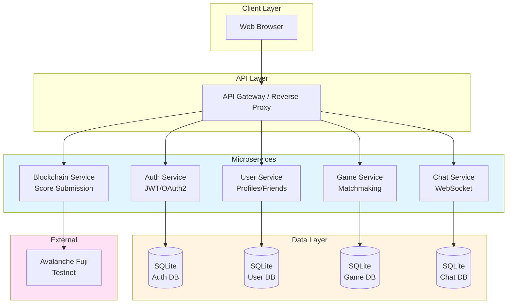
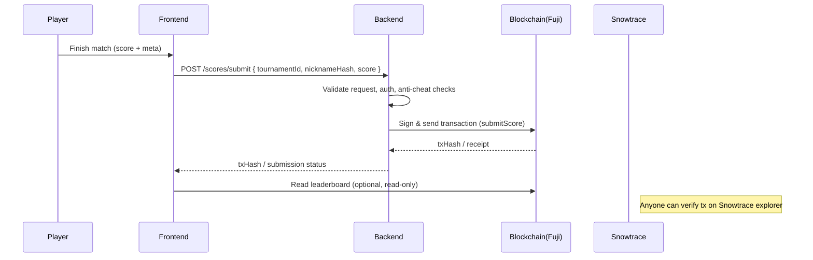

# Trascendence

A modern Pong web application with blockchain-backed tournament scores, microservices architecture, and advanced 3D graphics.  
**ft_transcendence (v18)** — 42 School Project

---

## Table of Contents

- [Team](#team)
- [Overview](#overview)
- [Modules](#modules)
  - [Major Modules](#major-modules-9)
  - [Minor Modules](#minor-modules-4)
- [Tech Stack](#tech-stack)
- [Architecture](#architecture)
- [Development Setup](#development-setup)
- [Project Structure](#project-structure)
- [API Endpoints (Core)](#api-endpoints-core)
- [Database Schema (Highlights)](#database-schema-highlights)
- [Smart Contract (TournamentScores.sol)](#smart-contract-tournamentscoressol)
- [Security](#security)
- [Testing](#testing)
- [Deployment](#deployment)
- [Documentation](#documentation)
- [Contributing](#contributing)
- [License](#license)
## Team

- **Andrea Falconi** — Backend architecture, authentication, user management, database
- **Pietro Jairo Pezzullo** — Blockchain integration, backend framework, live chat
- **Gabriele Rinella** — Frontend framework, 3D graphics, game development, live chat
- **Eugenio Caruso** — 3D graphics, game development
- **Ruggero** — Microservices design, infrastructure, logging & monitoring

---

## Overview

Trascendence is a modular Pong platform featuring:
- Real-time multiplayer gameplay with 3D graphics
- Permanent tournament scores on Avalanche Fuji blockchain
- Microservices backend with independent scalable services
- Live chat with game invitations
- OAuth2 authentication and comprehensive user management

---

## Timeline

Planned timeline: 06/10/2025 → 12/11/2025

Assumption: dates are in DD/MM/YYYY format. If you meant MM/DD/YYYY (US), tell me and I'll adjust.

- 06/10/2025 — 12/10/2025: Sprint 0 — Planning & infra
  - Finalize requirements, owners and acceptance criteria
  - Lock repository structure, .env example, Foundry base config
  - Run initial scaffold (repo tree, placeholder services, CI stubs)

- 13/10/2025 — 19/10/2025: Sprint 1 — Core infra & contracts
  - Implement initial `TournamentScores.sol` contract + unit tests
  - Add Foundry CI job and contract build pipeline
  - Basic API gateway and reverse-proxy skeleton

- 20/10/2025 — 26/10/2025: Sprint 2 — Auth & User services
  - Deliver `auth-service` (email/password, JWT, Google OAuth stub)
  - Deliver `user-service` (profiles, avatars, migrations)
  - DB migrations and local dev scripts

- 27/10/2025 — 02/11/2025: Sprint 3 — Game & Chat + Frontend skeleton
  - `game-service` basic matchmaking and match records
  - `chat-service` WebSocket skeleton and thread/messages storage
  - Frontend skeleton with Vite, Tailwind, and 3D canvas placeholder

- 03/11/2025 — 09/11/2025: Sprint 4 — Integration & E2E
  - End-to-end score submission: frontend → backend → Fuji (testnet)
  - Deploy contracts to Fuji testnet, generate `contracts.manifest.json`
  - Basic monitoring + logging dashboards (Prometheus/Grafana + ELK)
  - Integration tests and smoke tests

- 10/11/2025 — 12/11/2025: Stabilization & Release Candidate
  - Bug fixes, documentation polish, final contract verification
  - Prepare demo, release candidate image builds, handoff notes


## Modules

### Major Modules (9)

#### 🏗️ Microservices Backend (Ruggero, Andrea)
- **auth-service** — Registration, login, JWT/OAuth2
- **user-service** — Profiles, avatars, friends, statistics
- **game-service** — Matchmaking, matches, tournaments
- **chat-service** — WebSocket messaging, invites, notifications
- **blockchain-service** — Tournament score submission

Each service has REST APIs, Docker containers, and independent deployment.

#### ⛓️ Blockchain Tournament Scores (Pietro)
- Solidity smart contracts deployed on **Avalanche Fuji testnet**
- **Foundry** for compile, test, and deploy
- Tournament data structure: `{ tournamentId, nicknameHash, score }`
- Append-only, immutable leaderboard
- Frontend reads directly from blockchain

#### ⚡ Fastify Backend Framework (Andrea, Pietro)
- **TypeScript + Node.js** with Fastify
- **HTTPS/WSS** enforced for all communications
- **JSON Schema validation** (AJV) on all inputs
- **Pino logging** with correlation IDs
- **Rate limiting** on auth and chat endpoints
- **CORS** restricted to expected domains

#### 🔐 Standard User Management (Andrea)
- Secure registration/login with **JWT sessions**
- **Unique display names** for tournaments
- Editable profiles with **avatar upload** (default provided)
- **Friend system** with presence tracking (online/offline)
- **Match history** with wins/losses per user
- Duplicate email/username handling

#### 🌐 Remote OAuth2 Authentication (Andrea)
- **Google Sign-In** with OpenID Connect
- Authorization Code + **PKCE flow**
- State + nonce for CSRF protection
- **Account linking** for existing users
- Federated identities table: `(user_id, provider, provider_user_id)`
- Email verification and duplicate handling

#### 🎮 Additional Game + Matchmaking (Gabriele, Eugenio)
- **Second game** options: Breakout, Connect Four, or Snake
- **User game history** with statistics per game
- **Matchmaking system**: random or ELO-based pairing
- Database tables: `games`, `matches`, `user_stats`
- Integrated lobby for game selection

#### 🎨 Advanced 3D Graphics (Gabriele, Eugenio)
- **Babylon.js** 3D rendering engine
- Realistic **lighting and shadows** (HemisphericLight + PointLight)
- **Camera**: ArcRotateCamera for immersive view
- **Physics**: Cannon.js integration for realistic ball behavior
- **60fps target** performance
- Tailwind UI overlay on 3D canvas

#### 💬 Live Chat (Andrea, Pietro, Gabriele)
- **WebSocket** real-time messaging (WSS)
- **Direct messages** between users (1-on-1)
- **User blocking** (blocker cannot be contacted)
- **Game invitations** from chat → creates pending match
- **Tournament notifications** (next match announcements)
- **Profile access** directly from chat
- Tables: `threads`, `messages`, `blocks`, `invitations`

#### 📊 Log Management Infrastructure (Ruggero)
- **ELK Stack**: Elasticsearch, Logstash, Kibana
- Centralized structured JSON logging
- Request/response logs with timing
- Security event tracking
- Error aggregation and alerting

---

### Minor Modules (4)

#### 🗄️ SQLite Database (Andrea)
- **DB-per-service** architecture (each microservice has own DB)
- Schema **migrations** versioned in `db/migrations/*.sql`
- **WAL mode** (`PRAGMA journal_mode = WAL`) for concurrency
- **Foreign keys enforced** (`PRAGMA foreign_keys = ON`)
- **Indexes** on `user_id`, `created_at`, `thread_id`
- Docker volume persistence

#### 🎨 Tailwind CSS Frontend (Gabriele)
- **TypeScript SPA** (no vanilla JavaScript)
- **Only Tailwind CSS** for styling (utility-first)
- **History API** routing (browser back/forward support)
- **Responsive design** (mobile-first approach)
- **Firefox compatibility** guaranteed (+ modern browsers)
- Components: Navbar, PongCanvas, ChatBox, Login, Tournament views

#### ⚙️ Game Customization (Gabriele, Eugenio)
- **Power-ups**: paddle extension, multi-ball
- **Ball speed**: slow/normal/fast
- **Maps**: classic, obstacles, dark mode
- **Scoring rules**: configurable target (5, 10, 21 points)
- **Classic mode** always available
- Settings UI in lobby (pre-game configuration)

#### 📈 Monitoring System (Ruggero)
- **Prometheus** metrics collection
- **Grafana** dashboards
- Metrics tracked:
  - API request duration and count
  - Database query performance
  - Blockchain transaction success rate
  - WebSocket connection count
  - Error rates by endpoint

---

## Tech Stack

| Layer          | Technology                | Owner                    |
|----------------|---------------------------|--------------------------|
| **Frontend**   | TypeScript, Tailwind CSS  | Gabriele                 |
| **Backend**    | Fastify, Node.js, TS      | Andrea, Pietro, Ruggero  |
| **Database**   | SQLite (WAL mode)         | Andrea                   |
| **Blockchain** | Solidity, Foundry, Fuji   | Pietro                   |
| **3D Engine**  | Babylon.js, Cannon.js     | Gabriele, Eugenio        |
| **Auth**       | JWT, OAuth2 (Google)      | Andrea                   |
| **DevOps**     | Docker, ELK, Prometheus   | Ruggero                  |

---

## Architecture

### Microservices



### Data Flow: Score Submission



---

## Development Setup

```bash
# Clone repository
git clone https://github.com/ppezzull/Trascendence.git
cd Trascendence

# Install dependencies
npm install

# Environment setup
cp .env.example .env
# Edit .env with:
# - FUJI_RPC_URL (Avalanche testnet RPC)
# - PRIVATE_KEY (deployer wallet)
# - GOOGLE_CLIENT_ID and GOOGLE_CLIENT_SECRET
# - SESSION_SECRET (JWT signing key)

# Compile and test smart contracts
cd foundry
forge build
forge test -vv

# Deploy to Fuji testnet
forge create src/TournamentScores.sol:TournamentScores \
  --rpc-url $FUJI_RPC_URL \
  --private-key $PRIVATE_KEY \
  --verify

# Generate contract manifest
npm run export:manifest

# Start all services
cd ..
docker compose up --build
```

**Local URLs:**
- Frontend: http://localhost:3000
- Backend API: http://localhost:4000
- Grafana: http://localhost:3001
- Kibana: http://localhost:5601

---

## Project Structure

```
Trascendence/
├── Makefile
├── en.subject.pdf
├── docs/
│   ├── subject.md
│   └── Notion/
│       └── Goals 25cd7ca1fabc80c98deddf0598a9bb6f/
│           ├── Major module Designing the backend as microservice...md
│           ├── Major module Store the score of a tournament in th...md
│           ├── Major module Use a framework to build the backend...md
│           ├── Major module Standard user management, authenticat...md
│           ├── Major module Implementing a remote authentication...md
│           ├── Major module Add another game with user history an...md
│           ├── Major module Use advanced 3D techniques...md
│           ├── Major module Live chat...md
│           ├── Major module Infrastructure setup for log manageme...md
│           ├── Minor module Use a database for the backend...md
│           ├── Minor module Use a framework or a toolkit to build...md
│           ├── Minor module Game customization options...md
│           └── Minor module Monitoring system...md
├── foundry/                                    # Pietro
│   ├── foundry.toml
│   ├── README.md
│   ├── src/
│   │   ├── TournamentScores.sol
│   │   └── Counter.sol
│   ├── test/
│   │   ├── TournamentScores.t.sol
│   │   └── Counter.t.sol
│   ├── script/
│   │   └── Deploy.s.sol
│   └── lib/
│       └── forge-std/
└── srcs/
    ├── .env.example
    ├── docker-compose.yml
    └── requirements/
        ├── backend/
        │   ├── auth-service/                   # Andrea
        │   │   ├── Dockerfile
        │   │   ├── package.json
        │   │   ├── tsconfig.json
        │   │   ├── src/
        │   │   │   ├── app.ts
        │   │   │   ├── routes/
        │   │   │   ├── services/
        │   │   │   └── middleware/
        │   │   └── migrations/
        │   │       └── *.sql
        │   ├── user-service/                   # Andrea
        │   │   ├── Dockerfile
        │   │   ├── package.json
        │   │   ├── src/
        │   │   └── migrations/
        │   ├── game-service/                   # Gabriele, Eugenio
        │   │   ├── Dockerfile
        │   │   ├── package.json
        │   │   ├── src/
        │   │   └── migrations/
        │   ├── chat-service/                   # Andrea, Pietro, Gabriele
        │   │   ├── Dockerfile
        │   │   ├── package.json
        │   │   ├── src/
        │   │   └── migrations/
        │   └── blockchain-service/             # Pietro
        │       ├── Dockerfile
        │       ├── package.json
        │       ├── src/
        │       └── contracts.manifest.json
        ├── frontend/                           # Gabriele, Eugenio
        │   ├── Dockerfile
        │   ├── package.json
        │   ├── tsconfig.json
        │   ├── tailwind.config.js
        │   ├── postcss.config.js
        │   ├── vite.config.ts
        │   ├── src/
        │   │   ├── main.ts
        │   │   ├── App.tsx
        │   │   ├── components/
        │   │   │   ├── Navbar.tsx
        │   │   │   ├── PongCanvas.tsx
        │   │   │   └── ChatBox.tsx
        │   │   ├── pages/
        │   │   │   ├── Home.tsx
        │   │   │   ├── Login.tsx
        │   │   │   ├── Tournament.tsx
        │   │   │   └── Profile.tsx
        │   │   ├── graphics/
        │   │   │   ├── scene.ts
        │   │   │   ├── paddle.ts
        │   │   │   ├── ball.ts
        │   │   │   └── arena.ts
        │   │   └── styles/
        │   │       └── index.css
        │   ├── public/
        │   └── conf/
        │       └── nginx.conf
        └── infrastructure/                     # Ruggero
            ├── elk/
            │   ├── elasticsearch/
            │   │   ├── Dockerfile
            │   │   └── conf/
            │   │       └── elasticsearch.yml
            │   ├── logstash/
            │   │   ├── Dockerfile
            │   │   └── conf/
            │   │       └── logstash.conf
            │   └── kibana/
            │       ├── Dockerfile
            │       └── conf/
            │           └── kibana.yml
            └── monitoring/
                ├── prometheus/
                │   ├── Dockerfile
                │   └── conf/
                │       └── prometheus.yml
                └── grafana/
                    ├── Dockerfile
                    └── conf/
                        ├── datasources/
                        └── dashboards/
```

---

## API Endpoints (Core)

### Authentication
```
POST   /auth/register                 # Register with email/password
POST   /auth/login                    # Login → JWT
GET    /auth/google                   # OAuth2 redirect
GET    /auth/google/callback          # OAuth2 callback
POST   /auth/logout                   # Invalidate session
GET    /auth/me                       # Current user profile
```

### Users
```
GET    /users/:id                     # User profile
PATCH  /users/:id                     # Update profile/avatar
GET    /users/:id/stats               # Win/loss statistics
GET    /users/:id/history             # Match history
POST   /users/:id/friends             # Add friend
DELETE /users/:id/friends/:friendId   # Remove friend
```

### Games & Matchmaking
```
GET    /games                         # List available games
POST   /matchmaking/find              # Find opponent
GET    /matches/:id                   # Match details
POST   /matches/:id/options           # Set game customization
```

### Chat (WebSocket)
```
WSS    /chat/ws                       # WebSocket connection
POST   /chat/messages                 # Send message
GET    /chat/threads/:id/messages     # Message history
POST   /chat/blocks                   # Block user
POST   /chat/invitations              # Invite to game
```

### Blockchain
```
POST   /scores/submit                 # Submit to blockchain
GET    /scores/:tournamentId          # Read leaderboard
GET    /scores/verify/:txHash         # Verify transaction
```

---

## Database Schema (Highlights)

### Users & Auth
```sql
CREATE TABLE users (
  id INTEGER PRIMARY KEY AUTOINCREMENT,
  email TEXT UNIQUE NOT NULL,
  display_name TEXT UNIQUE NOT NULL,
  password_hash TEXT,
  avatar_url TEXT,
  created_at TEXT DEFAULT (datetime('now'))
);

CREATE TABLE federated_identities (
  user_id INTEGER NOT NULL,
  provider TEXT NOT NULL,              -- 'google'
  provider_user_id TEXT NOT NULL,      -- OAuth sub
  email_verified INTEGER DEFAULT 0,
  PRIMARY KEY (provider, provider_user_id),
  FOREIGN KEY (user_id) REFERENCES users(id)
);
```

### Games & Matches
```sql
CREATE TABLE games (
  id INTEGER PRIMARY KEY AUTOINCREMENT,
  name TEXT NOT NULL UNIQUE            -- 'pong', 'breakout', etc.
);

CREATE TABLE matches (
  id INTEGER PRIMARY KEY AUTOINCREMENT,
  game_id INTEGER NOT NULL,
  player1_id INTEGER NOT NULL,
  player2_id INTEGER NOT NULL,
  score_p1 INTEGER,
  score_p2 INTEGER,
  played_at TEXT DEFAULT (datetime('now')),
  FOREIGN KEY (game_id) REFERENCES games(id)
);

CREATE TABLE user_stats (
  user_id INTEGER,
  game_id INTEGER,
  wins INTEGER DEFAULT 0,
  losses INTEGER DEFAULT 0,
  elo INTEGER DEFAULT 1000,
  PRIMARY KEY (user_id, game_id)
);
```

### Chat
```sql
CREATE TABLE threads (
  id INTEGER PRIMARY KEY AUTOINCREMENT,
  is_group INTEGER DEFAULT 0
);

CREATE TABLE messages (
  id INTEGER PRIMARY KEY AUTOINCREMENT,
  thread_id INTEGER NOT NULL,
  sender_id INTEGER NOT NULL,
  content TEXT NOT NULL,
  created_at TEXT DEFAULT (datetime('now')),
  FOREIGN KEY (thread_id) REFERENCES threads(id)
);

CREATE TABLE blocks (
  blocker_id INTEGER,
  blocked_id INTEGER,
  PRIMARY KEY (blocker_id, blocked_id)
);
```

---

## Smart Contract (TournamentScores.sol)

```solidity
struct Entry {
    bytes32 nicknameHash;  // keccak256(lowercase(nickname))
    uint32 score;
}

struct Tournament {
    bool exists;
    uint64 createdAt;
    Entry[] entries;
    mapping(bytes32 => bool) seen;  // Prevent duplicates
}

mapping(bytes32 => Tournament) public tournaments;

function createTournament(bytes32 tournamentId) external;
function submitScore(bytes32 tournamentId, bytes32 nicknameHash, uint32 score) external;
function getLeaderboard(bytes32 tournamentId) external view returns (Entry[] memory);
```

**Network**: Avalanche Fuji Testnet (Chain ID: 43113)  
**Explorer**: https://testnet.snowtrace.io/

---

## Security

- ✅ **HTTPS/WSS** enforced in production
- ✅ **Input validation** with JSON Schema (AJV)
- ✅ **JWT** with HttpOnly cookies (SameSite=Strict)
- ✅ **OAuth2 PKCE** flow for Google Sign-In
- ✅ **Rate limiting** on auth/chat endpoints
- ✅ **Password hashing** with bcrypt (cost 12)
- ✅ **SQL injection** prevention (parameterized queries)
- ✅ **XSS protection** (React DOM + CSP headers)
- ✅ **Private keys** only in `.env` (gitignored)
- ✅ **Foreign keys** enforced in SQLite

---

## Testing

```bash
# Smart contracts
cd foundry
forge test -vv
forge coverage

# Backend
cd backend
npm test
npm run test:integration

# Frontend
cd frontend
npm test
npm run test:e2e
```

---

## Deployment

### Docker Compose

```bash
docker compose up --build
```

**Services:**
- `frontend` — React + Tailwind (Nginx)
- `backend-*` — Microservices (Fastify)
- `elasticsearch` — Log storage
- `logstash` — Log processing
- `kibana` — Log visualization
- `prometheus` — Metrics collection
- `grafana` — Metrics visualization

### CI/CD Pipeline

1. Build smart contracts with Foundry
2. Deploy to Avalanche Fuji
3. Generate `contracts.manifest.json` (ABI + address)
4. Build Docker images for all services
5. Deploy with `docker compose up`

---

## Documentation

Detailed module specifications in `docs/Notion/Goals 25cd7ca1fabc80c98deddf0598a9bb6f/`:

- [Backend as Microservices](docs/Notion/Goals%2025cd7ca1fabc80c98deddf0598a9bb6f/Major%20module%20Designing%20the%20backend%20as%20microservice%2025cd7ca1fabc8074b498d7920370b01a.md)
- [Blockchain Tournament Scores](docs/Notion/Goals%2025cd7ca1fabc80c98deddf0598a9bb6f/Major%20module%20Store%20the%20score%20of%20a%20tournament%20in%20th%2025cd7ca1fabc8030a15cd70cf4a1af32.md)
- [Fastify Backend Framework](docs/Notion/Goals%2025cd7ca1fabc80c98deddf0598a9bb6f/Major%20module%20Use%20a%20framework%20to%20build%20the%20backend%2025cd7ca1fabc80cab8bee3e212f98cab.md)
- [Standard User Management](docs/Notion/Goals%2025cd7ca1fabc80c98deddf0598a9bb6f/Major%20module%20Standard%20user%20management,%20authenticat%2025cd7ca1fabc80a393d8ca9aaeb3af53.md)
- [Remote OAuth2 Authentication](docs/Notion/Goals%2025cd7ca1fabc80c98deddf0598a9bb6f/Major%20module%20Implementing%20a%20remote%20authentication%2025cd7ca1fabc80cdb1f9cb0e67f75336.md)
- [Additional Game + Matchmaking](docs/Notion/Goals%2025cd7ca1fabc80c98deddf0598a9bb6f/Major%20module%20Add%20another%20game%20with%20user%20history%20an%2025cd7ca1fabc80f487c4c3a57b2fa36c.md)
- [Advanced 3D Techniques](docs/Notion/Goals%2025cd7ca1fabc80c98deddf0598a9bb6f/Major%20module%20Use%20advanced%203D%20techniques%2025cd7ca1fabc80fab1c5c77b334d87bc.md)
- [Live Chat](docs/Notion/Goals%2025cd7ca1fabc80c98deddf0598a9bb6f/Major%20module%20Live%20chat%2025cd7ca1fabc808e9450db33cc2feb69.md)
- [SQLite Database](docs/Notion/Goals%2025cd7ca1fabc80c98deddf0598a9bb6f/Minor%20module%20Use%20a%20database%20for%20the%20backend%2025cd7ca1fabc803589d8c9e38b3422bc.md)
- [Tailwind CSS Frontend](docs/Notion/Goals%2025cd7ca1fabc80c98deddf0598a9bb6f/Minor%20module%20Use%20a%20framework%20or%20a%20toolkit%20to%20build%2025cd7ca1fabc80478737f145097f157b.md)
- [Game Customization](docs/Notion/Goals%2025cd7ca1fabc80c98deddf0598a9bb6f/Minor%20module%20Game%20customization%20options%2025cd7ca1fabc8016889dee5504f07189.md)

---

## Contributing

**Workflow:**
1. Create feature branch from `main`
2. Implement module per documentation
3. Write tests (unit + integration)
4. Test locally with Docker
5. Open PR → code review by module owner
6. Merge when approved + CI passes

**Branch naming:**
- `feature/backend-{service-name}`
- `feature/frontend-{feature-name}`
- `feature/blockchain-{contract-name}`
- `feature/infra-{component}`

---

## Built by:
Andrea Falconi • Pietro Jairo Pezzullo • Gabriele Rinella • Eugenio Caruso • Ruggero

